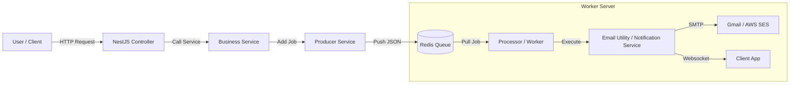

# Redis & BullMQ Implementation Guide: Email & Notifications

This guide provides a complete "A to Z" reference for implementing a Queue-based Email and Notification system in NestJS using Redis and BullMQ. It covers the architecture, setup, and real-world examples (Auth, Appointment, Blog) with exact code.

## 1. Architecture Overview

We use **BullMQ** (on top of **Redis**) to handle background jobs. This ensures that heavy tasks like sending emails or broadcasting notifications do not block the main API response.

### Flow Diagram



---

## 2. Core Implementation (The "Engine")

These files set up the queue system. You only need to set these up once.

### A. Queue Constants

Define your queue names and job types here.
**File:** `src/queue/queue.constants.ts`

```typescript
export const QUEUE = {
  EMAILS: 'emails',
  NOTIFICATIONS: 'notifications',
  ACTIVITIES: 'activities',
  EVENTS: 'events',
} as const;

export const JOB = {
  SEND_EMAIL: 'send-email',
  CREATE_NOTIFICATION: 'create-notification',
  CREATE_ACTIVITY: 'create-activity',
  PROCESS_SYSTEM_EVENT: 'process-system-event',
  PROCESS_ADMIN_EVENT: 'process-admin-event',
} as const;
```

### B. Email Producer (The Trigger)

This service is used to **add** email jobs to the queue.
**File:** `src/queue/producers/email.producer.ts`

```typescript
import { InjectQueue } from '@nestjs/bullmq';
import { Injectable } from '@nestjs/common';
import { Queue } from 'bullmq';
import { JOB, QUEUE } from '../queue.constants';

export type SendEmailPayload = {
  to: string;
  subject: string;
  html: string;
};

@Injectable()
export class EmailProducer {
  constructor(
    @InjectQueue(QUEUE.EMAILS)
    private readonly queue: Queue,
  ) {}

  async send(payload: SendEmailPayload) {
    // Adds a job to Redis
    await this.queue.add(JOB.SEND_EMAIL, payload, {
      attempts: 3, // Retry 3 times if failed
      backoff: { type: 'exponential', delay: 1000 },
      removeOnComplete: true, // Auto-delete successful jobs
    });
  }
}
```

### C. Email Processor (The Worker)

This service runs in the background, picks up jobs, and actually sends the email.
**File:** `src/queue/processors/email.processors.ts`

```typescript
import { Processor, WorkerHost } from '@nestjs/bullmq';
import { ConfigService } from '@nestjs/config';
import { Job } from 'bullmq';
import { sendVerificationEmail } from 'src/utils/sendVerificationEmail';
import type { SendEmailPayload } from '../producers/email.producer';
import { JOB, QUEUE } from '../queue.constants';

@Processor(QUEUE.EMAILS)
export class EmailProcessor extends WorkerHost {
  constructor(private readonly configService: ConfigService) {
    super();
  }

  async process(job: Job<SendEmailPayload>) {
    if (job.name !== JOB.SEND_EMAIL) {
      return { ignored: true };
    }

    // Call the actual email sending utility
    const result = await sendVerificationEmail(
      this.configService,
      job.data.to,
      job.data.subject,
      job.data.html,
    );

    if (!result?.success) {
      throw new Error(
        typeof result?.error === 'string'
          ? result.error
          : 'Email sending failed',
      );
    }

    return { success: true };
  }
}
```

### D. Email Utility (Nodemailer)

The actual code that connects to SMTP (Gmail/AWS) and sends the mail.
**File:** `src/utils/sendVerificationEmail.ts`

```typescript
import { ConfigService } from '@nestjs/config';
import * as nodemailer from 'nodemailer';

export async function sendVerificationEmail(
  configService: ConfigService,
  to: string,
  subject: string,
  html: string,
) {
  const smtpUser = configService.get<string>('SMTP_USER');
  const smtpPass = configService.get<string>('SMTP_PASS');
  const smtpHost = configService.get<string>('SMTP_HOST') ?? 'smtp.gmail.com';
  const smtpPort = Number(configService.get<string>('SMTP_PORT') ?? 587);
  const smtpFrom = configService.get<string>('SMTP_FROM') ?? smtpUser;

  if (!smtpUser || !smtpPass) {
    return { success: false, error: 'SMTP configuration missing' };
  }

  const transporter = nodemailer.createTransport({
    host: smtpHost,
    port: smtpPort,
    secure: false, // true for 465, false for other ports
    auth: {
      user: smtpUser,
      pass: smtpPass,
    },
  });

  try {
    const info = await transporter.sendMail({
      from: smtpFrom,
      to,
      subject,
      html,
    });
    console.log('Email sent:', info.response);
    return { success: true, info };
  } catch (error) {
    console.error('Email error:', error);
    return {
      success: false,
      error: error instanceof Error ? error.message : 'Unknown error',
    };
  }
}
```

---

## 3. Real-World Examples (The "Cookbook")

Here is how you wire everything together in your actual business logic (Controllers/Services).

### Scenario 1: User Registration

**Trigger:** When a user signs up.
**Actions:**

1. Send "Welcome" Email to User.
2. Send "New User" Notification to Admins.

**Code:** `src/auth/auth.service.ts`

```typescript
import { Injectable } from '@nestjs/common';
import { EmailProducer } from 'src/queue/producers/email.producer'; // 1. Import Email Producer
import { EventService } from 'src/event/event.service'; // 2. Import Event Service
import { NotificationEvent, UserRole } from '@prisma/client';

@Injectable()
export class AuthService {
  constructor(
    private readonly emailProducer: EmailProducer,
    private readonly eventService: EventService,
    // ... other dependencies like PrismaService
  ) {}

  async register(dto: RegisterDto) {
    // 1. Create User in DB
    const user = await this.prisma.user.create({ ... });

    // 2. Trigger Welcome Email (Async via Queue)
    await this.emailProducer.send({
      to: user.email,
      subject: 'Welcome to Marcus!',
      html: `<h1>Hello ${user.name}</h1><p>Thanks for joining us.</p>`,
    });

    // 3. Trigger Admin Notification (Async via Queue)
    await this.eventService.emitSystemEvent({
      event: NotificationEvent.USER_REGISTERED, // Ensure this enum exists
      entityId: user.id,
      actorId: user.id,
      actorRole: UserRole.CUSTOMER,
      // Metadata allows dynamic messages
      metadata: { name: user.name, email: user.email },
    });

    return user;
  }
}
```

### Scenario 2: Appointment Booking

**Trigger:** User books an appointment.
**Actions:**

1. Send Confirmation Email to User.
2. Send Notification to Doctor/Admin.

**Code:** `src/appointment/appointment.service.ts`

```typescript
import { Injectable } from '@nestjs/common';
import { EmailProducer } from 'src/queue/producers/email.producer';
import { EventService } from 'src/event/event.service';
import { NotificationEvent, UserRole } from '@prisma/client';

@Injectable()
export class AppointmentService {
  constructor(
    private readonly emailProducer: EmailProducer,
    private readonly eventService: EventService,
    // ... prisma
  ) {}

  async createAppointment(userId: string, dto: CreateAppointmentDto) {
    // 1. Save Appointment
    const appointment = await this.prisma.appointment.create({ ... });
    const user = await this.prisma.user.findUnique({ where: { id: userId } });

    // 2. Send Confirmation Email
    await this.emailProducer.send({
      to: user.email,
      subject: 'Appointment Confirmed',
      html: `<p>Your appointment on ${appointment.date} is confirmed.</p>`,
    });

    // 3. Notify System (Admins/Doctors)
    await this.eventService.emitSystemEvent({
      event: NotificationEvent.APPOINTMENT_CREATED,
      entityId: appointment.id,
      actorId: userId,
      actorRole: UserRole.CUSTOMER,
      metadata: {
        date: appointment.date,
        service: appointment.serviceName
      },
    });

    return appointment;
  }
}
```

### Scenario 3: New Blog Post

**Trigger:** Admin creates a blog post.
**Actions:**

1. Broadcast Notification to all users (or subscribers).
2. (Optional) Send Email Blast.

**Code:** `src/blog/blog.service.ts`

```typescript
import { Injectable } from '@nestjs/common';
import { EventService } from 'src/event/event.service';
import { EmailProducer } from 'src/queue/producers/email.producer';
import { NotificationEvent, UserRole } from '@prisma/client';

@Injectable()
export class BlogService {
  constructor(
    private readonly eventService: EventService,
    private readonly emailProducer: EmailProducer,
    // ... prisma
  ) {}

  async createBlog(adminId: string, dto: CreateBlogDto) {
    // 1. Create Blog
    const blog = await this.prisma.blog.create({ ... });

    // 2. Broadcast Notification (In-App)
    // The EventService handles finding all target users
    await this.eventService.emitSystemEvent({
      event: NotificationEvent.BLOG_CREATED,
      entityId: blog.id,
      actorId: adminId,
      actorRole: UserRole.ADMIN,
      broadcast: true, // This flag tells EventService to notify EVERYONE
      metadata: { title: blog.title, slug: blog.slug },
    });

    // 3. (Optional) Email Newsletter
    // For large lists, you might create a separate "PROCESS_NEWSLETTER" job
    // But for simple use cases, you can loop (careful with large loops!)
    /*
    const subscribers = await this.prisma.subscriber.findMany();
    for (const sub of subscribers) {
      await this.emailProducer.send({
        to: sub.email,
        subject: `New Post: ${blog.title}`,
        html: `<p>Read our new post...</p>`
      });
    }
    */

    return blog;
  }
}
```

## 4. How to Add a New Queue in Future

If you need a new type of background job (e.g., **Image Processing**):

1.  **Add Constant**: Add `IMAGES: 'images'` to `QUEUE` in `queue.constants.ts`.
2.  **Create Producer**: Copy `email.producer.ts`, rename to `image.producer.ts`, inject `QUEUE.IMAGES`.
3.  **Create Processor**: Copy `email.processors.ts`, rename to `image.processor.ts`, use `@Processor(QUEUE.IMAGES)`.
4.  **Register in Module**: Add `BullModule.registerQueue({ name: QUEUE.IMAGES })` in `queue.module.ts` and add the new Producer/Processor to `providers`.
5.  **Use it**: Inject `ImageProducer` in your service and call `await this.imageProducer.add(...)`.

## Code References

- [queue.constants.ts](file:///c:/Zayed/marcus-backend-nestjs/src/queue/queue.constants.ts)
- [email.producer.ts](file:///c:/Zayed/marcus-backend-nestjs/src/queue/producers/email.producer.ts)
- [email.processors.ts](file:///c:/Zayed/marcus-backend-nestjs/src/queue/processors/email.processors.ts)
- [sendVerificationEmail.ts](file:///c:/Zayed/marcus-backend-nestjs/src/utils/sendVerificationEmail.ts)
